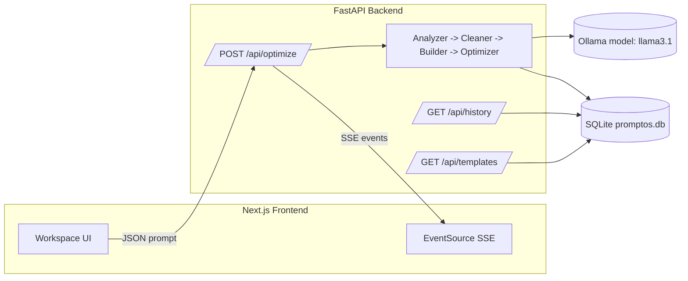

# PromptOS

Transform messy prompts into optimized, structured outputs with a 4-agent AI pipeline and real-time streaming UI.

## Architecture



## Features

- 4-agent pipeline with explicit stages and metrics
- SSE streaming for live progress and step results
- Templates library with category filtering
- History with searchable runs and score metadata
- Settings for theme and dev-mode controls

## Tech Stack

- Frontend: Next.js, TypeScript, Tailwind CSS, Framer Motion, Zustand
- Backend: FastAPI, SQLAlchemy, SQLite
- AI: Ollama (llama3.1 by default)

## Requirements

- Node.js and npm
- Python
- Ollama installed and running locally

## Local Development

1) Start Ollama

```bash
ollama serve
ollama pull llama3.1
```

2) Start Backend

```bash
cd backend
python -m venv venv
# Windows
venv\Scripts\activate
# macOS/Linux
source venv/bin/activate
pip install -r requirements.txt
uvicorn main:app --reload --port 8000
```

3) Start Frontend

```bash
cd frontend
npm install
npm run dev
```

Open http://localhost:3000

## Environment Variables

Create [frontend/.env.local](frontend/.env.local) if you want Google login via NextAuth.

```
GOOGLE_CLIENT_ID=your_google_client_id
GOOGLE_CLIENT_SECRET=your_google_client_secret
NEXTAUTH_SECRET=your_nextauth_secret
```

## API Reference

- `GET /health`
	- Returns service status and version.
- `POST /api/optimize` (SSE)
	- Request JSON:
		```json
		{
			"prompt": "Your prompt",
			"format": "gpt",
			"model": "llama3.1"
		}
		```
	- Streams `step_start`, `step_complete`, `progress`, and `complete` events.
- `GET /api/history?search=&limit=&offset=`
	- Returns past runs with scores and metadata.
- `GET /api/history/{item_id}`
	- Returns a single history item.
- `GET /api/templates?category=all|coding|writing|analysis|marketing`
	- Returns seeded template prompts.

## Production Notes

- Update CORS origins in [backend/main.py](backend/main.py) for your frontend domain.
- The SQLite file is created at `backend/promptos.db` on first run.
- Frontend build and start:
	```bash
	cd frontend
	npm run build
	npm run start
	```
- Backend (example):
	```bash
	cd backend
	uvicorn main:app --host 0.0.0.0 --port 8000
	```

## Project Structure

- [backend/](backend/) - FastAPI app, pipeline, routers, DB models
- [frontend/](frontend/) - Next.js app, components, and UI state
- [scratch/](scratch/) - local diagnostics
- [crop.py](crop.py) - utility script
